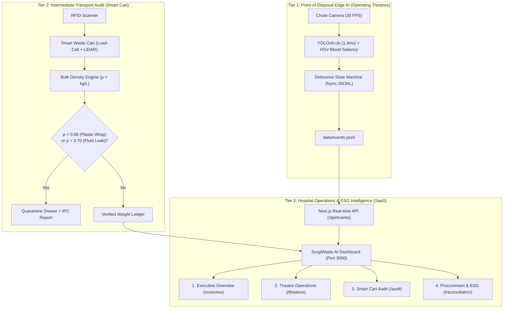

# SurgiWaste AI — Hospital Operating Theatre Waste Intelligence Infrastructure

> **Enterprise AI Infrastructure for Operating Theatre Waste Diversion, Physical Bag Logistics Audit, and Scope 3 ESG Intelligence.**  
> Compliant with **Australian Standard AS/NZS 3816:2018 (Management of Clinical and Related Wastes)** and SA Health Green Theatres Framework.

---

## 📌 Executive Summary (개요)

In modern Australian hospital operating theatres (OT), up to **60% of sterile plastic and paper packaging** is mistakenly discarded into high-cost **Yellow Biohazard Bins** prior to patient incision (Phase 1 Setup). This causes:
1. **Severe Budget Leaks**: Biohazard incineration costs **$3.50/kg vs $0.35/kg** for general/recyclable waste (~10x cost difference).
2. **Environmental Footprint**: Unnecessary high-temperature incineration increases Scope 3 carbon emissions.
3. **Infection Control & Sharps Violations**: Misplaced sharps or liquid canisters create regulatory compliance breaches.

**SurgiWaste AI** solves this through a **3-Tier Closed-Loop Infrastructure**:
* **Tier 1 (At the Bin)**: Non-disruptive Edge Vision classifying items at the waste chute in 1.4ms with active biohazard/blood HSV detection.
* **Tier 2 (At the Corridor)**: Non-destructive Smart Cart Bulk Density ($\rho = \text{kg/L}$) audit verifying bag integrity without unsealing bags.
* **Tier 3 (At the Management Suite)**: Real-time Next.js 14 Enterprise SaaS Dashboard for multi-theatre workflow analytics, contractor invoice cross-audit, and Scope 3 ESG reporting.

---

## 🏗️ 3-Tier System Architecture



---

## 🧠 AI Model & Clinical Vision Engine (Tier 1)

* **Architecture**: Fine-tuned `YOLOv8s-cls` (Ultralytics) with HSV Blood Contamination Hybrid Filter.
* **Hardware Acceleration**: Apple Silicon MPS / NVIDIA CUDA / CPU fallback.
* **Clinical 4-Category Mapping (AS/NZS 3816 Compliant)**:
  * `Clean_Plastic`: Sterile packaging overwrap, saline/IV bottles, blister trays.
  * `Clean_Paper`: Outer cardboard boxes, sterile drape packaging wallets.
  * `Biohazard_Infectious`: Blood-soaked gauze, organic waste, used surgical gloves.
  * `Sharps_Hazard`: Scalpels, suture needles, ampoules/vials, surgical scissors.
* **Benchmark Performance**:
  * **Top-1 Validation Accuracy**: `97.90%`
  * **Independent Hold-out Test Accuracy**: `96.79%`
  * **Inference Latency**: `1.4 ms` (~700 FPS throughput)
  * **Model Footprint**: `10.3 MB` ([`models/medwaste_yolov8_cls.pt`](file:///Users/cheonsejun/Developer/Hackathon/models/medwaste_yolov8_cls.pt))

---

## 💻 Tech Stack & Dependencies

| Layer | Technologies / Libraries | Purpose |
|---|---|---|
| **Edge Vision & Backend** | Python 3.11+, PyTorch (MPS), OpenCV, Ultralytics YOLO, Pydantic v2, FastAPI | Real-time frame processing, classification, and event logging |
| **Package Management** | `uv` (Astral) / `hatchling` | Ultra-fast Python package resolution & zero-config environment |
| **Web Dashboard** | Next.js 14 (App Router), TypeScript, Tailwind CSS, Recharts, Lucide React | High-density Light Enterprise B2B SaaS interface |
| **Data Contract** | JSON Lines (`data/events.jsonl`) with immediate disk `fsync()` | Zero-latency event pipeline between Edge Vision and Dashboard |

---

## 📂 Project Directory Structure

```
.
├── assets/
│   └── demo_samples/           # 📦 Bundled lightweight sample images for instant CLI demo
│       ├── Clean_Plastic/
│       ├── Clean_Paper/
│       ├── Biohazard_Infectious/
│       └── Sharps_Hazard/
│
├── dashboard/                  # 🌐 [Tier 3] Next.js 14 Enterprise SaaS Application
│   ├── app/
│   │   ├── overview/page.tsx   # View 1: Executive KPI & Dual-Axis Cost Trend
│   │   ├── theatres/page.tsx   # View 2: 12-OT Grid, 3-Phase Donut & Hourly Influx
│   │   ├── audit/page.tsx      # View 3: Bulk Density Scatter Plot & Quarantine Drawer
│   │   ├── reconciliation/     # View 4: Contractor Overbilling Audit & ESG Export
│   │   └── api/events/route.ts # Real-time events.jsonl streaming API
│   ├── components/layout/      # Clean Light Enterprise Sidebar & Header
│   ├── lib/                    # mock-data.ts (12-OTs, Period Maps), utils.ts ($AUD, kg)
│   └── package.json
│
├── vision_system/              # 🔬 [Tier 1] Edge Vision Pipeline Module
│   ├── config/settings.py      # Camera ROI, Auto-resolved BASE_DIR, HSV Thresholds
│   ├── core/
│   │   ├── camera.py           # Thread-safe non-blocking OpenCV stream
│   │   ├── detector.py         # YOLOv8-cls + HSV Blood Contamination Engine
│   │   ├── tracker.py          # State machine debouncer & fsync JSONL logger
│   │   └── visualizer.py       # Clinical HUD overlay & warning banner renderer
│   ├── shared/schemas.py       # Pydantic v2 event contracts & enums
│   └── scripts/                # Dataset splitting, fine-tuning & evaluation scripts
│
├── models/
│   └── medwaste_yolov8_cls.pt  # 🎯 Fine-tuned 10.3MB Production Classifier (Included in repo)
│
├── docs/                       # 📖 System design & clinical reference documents
│   ├── Concept.md              # 3-Tier Infrastructure Concept & Australian Standards
│   ├── VisionModel_Plan.md     # Vision Architecture & Confusion Matrix
│   └── Dashboard_Plan.md       # SaaS UI/UX & Healthcare Design System
│
├── tests/
│   └── test_vision_pipeline.py # Unit tests for misclassification rules & event logging
│
├── run_vision.py               # 🚀 [CLI 1] Live Webcam Real-Time Vision Entrypoint
├── run_demo_simulation.py      # 🚀 [CLI 2] Interactive Static Image Inspection Demo
├── pyproject.toml              # Python package metadata & dependencies
└── .gitignore                  # Production-grade Git ignore rules
```

---

## 🚀 Quickstart & Installation

### Prerequisites
* **Python**: `3.11` or higher (Managed via [`uv`](https://github.com/astral-sh/uv) recommended)
* **Node.js**: `18.0.0` or higher & `npm`

---

### Step 1. Clone & Setup Python Environment

```bash
# Clone the repository
git clone https://github.com/your-repo/surgiwaste-ai.git
cd surgiwaste-ai

# Verify Python dependencies with uv (automatically resolves in seconds)
uv run python tests/test_vision_pipeline.py
```

---

### Step 2. Launch the Next.js SaaS Dashboard (Tier 3)

```bash
cd dashboard
npm install

# Start local development server
npm run dev
# OR build and run production server
npm run build && npm run start
```
* Open your browser and navigate to **`http://localhost:3000`**.

---

### Step 3. Run Vision Pipeline CLI (Tier 1)

#### Option A: Interactive Static Image Inspection Demo (No Webcam Required)
Ideal for testing and demonstrations without actual medical waste on hand. Uses bundled sample photos from [`assets/demo_samples/`](file:///Users/cheonsejun/Developer/Hackathon/assets/demo_samples).

```bash
uv run python run_demo_simulation.py
```
* **Controls**:
  * `[SPACE]` / `[N]`: Next sample image
  * `[P]`: Previous sample image
  * `[1]`: Switch target bin to **Yellow Biohazard** (triggers misclassification alert on clean items)
  * `[2]`: Switch target bin to **General Recycle**
  * `[3]`: Switch target bin to **Sharps Container**
  * `[D]`: **Drop item into chute** (Instantly logs event to `data/events.jsonl` and updates the Dashboard live toast!)
  * `[Q]` / `[ESC]`: Exit demo

#### Option B: Live Webcam Real-time Vision Stream
Connects directly to your webcam and monitors the green waste chute ROI zone:

```bash
uv run python run_vision.py
```
* **Controls**:
  * `[1]`, `[2]`, `[3]`: Toggle Target Bin Stream
  * `[Q]`: Exit stream

---

## 📊 Dashboard Views Guide (What to Explore)

1. **Executive Overview (`/overview`)**:
   - Change the **Audit Period** dropdown (`August 2026`, `July 2026`, `June 2026`, `Q2 2026`) to observe dynamic KPI updates, dual-axis cost curves, and department rankings.
2. **Theatre Operations (`/theatres`)**:
   - Select specific surgical suites (`OT_03 Orthopaedics`, `OT_04 Neurosurgery`, `OT_12 Trauma`, etc.) or click table rows to see theatre-specific **3-Phase Donut Ratios (74% Phase 1 Setup surge)**, hourly influx curves, and top misclassified disposables.
3. **Smart Cart Audit (`/audit`)**:
   - Inspect the **Bulk Density Scatter Plot** with $\rho = 0.08\,\text{kg/L}$ (lightweight packaging trap) and $\rho = 0.70\,\text{kg/L}$ (fluid leak violation) reference lines. Click any bag to view the **RFID Quarantine Drawer**.
4. **Procurement & ESG (`/reconciliation`)**:
   - Review contractor overbilling discrepancy table (Cleanaway vs Daniels Health), CPT pack de-bundling savings, and click **"Export Green Theatres ESG Report"** to simulate official SA Health reporting.

---

## 🧪 Testing & Verification

Run automated test suites to verify classifier logic and state machine debouncing:

```bash
# Run unit tests
uv run python tests/test_vision_pipeline.py

# Verify package import
uv run python -c "from vision_system.core.detector import WasteDetector; print('Pipeline OK')"
```

---

## 📜 Regulatory & Safety Compliance
* **Standard**: AS/NZS 3816:2018 Management of Clinical and Related Wastes
* **Infection Control**: Non-destructive physical density audit eliminates manual unsealing of contaminated yellow bags.
* **Privacy & Security**: Vision inference runs 100% locally on Edge hardware with zero patient facial/EMR data transmission outside hospital premises.
