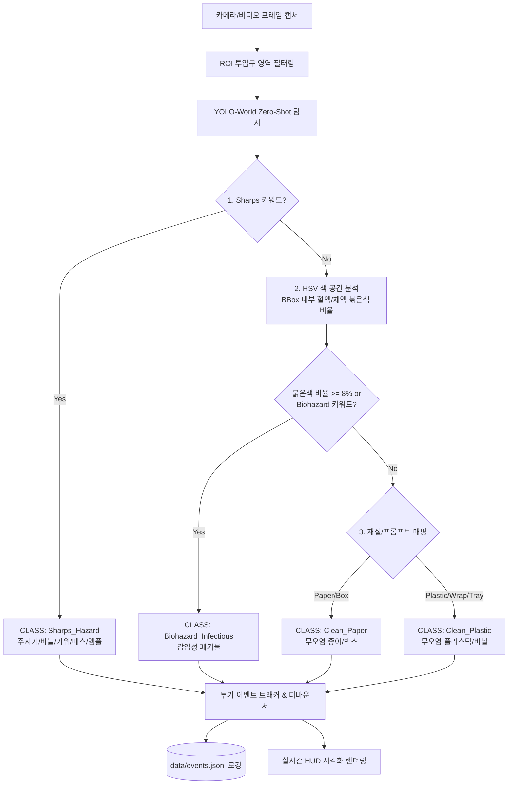

# 수술실 폐기물 4대 성상 실시간 비전 감지 시스템 구현 계획

수술실 폐기물 스마트 관리 인프라의 **Tier 1 (실시간 배출 순간 엣지 비전 감지)** 모듈을 구현합니다.
사전 대규모 학습 없이도 `YOLO-World` Zero-Shot 객체 탐지와 `OpenCV HSV 혈액/체액 오염 분석(Heuristics)`을 결합하여, 투입구(ROI)로 유입되는 쓰레기를 **4대 성상**으로 실시간 판정하고 오투기 이벤트를 디바운싱하여 정형 데이터(`data/events.jsonl`)로 로깅합니다.

---

## 1. 핵심 요구사항 및 분석

### 1.1 4대 성상 분류 기준 및 판정 파이프라인

### 1.2 주요 기능 및 개선점
1. **YOLO-World Zero-Shot 최적화**:
   - `yolov8s-worldv2.pt` 모델 사용 및 의료/포장재 특화 텍스트 프롬프트 구성.
   - 클래스별 Confidence Threshold 차등 적용 (Sharps는 민감도 높게, 플라스틱/종이는 오탐 방지).
2. **HSV 적색 2채널 오염 감지 필터**:
   - Hue 0~10 및 170~180 영역 결합 마스크 처리 + 조도 변화 대응 (적절한 S/V 하한선 설정).
   - BBox 내부 마스크 면적 비율 계산으로 미세 오염/대량 오염 구분.
3. **상태 머신 기반 투기 디바운서 (Drop Tracker)**:
   - 단순히 객체가 보였다 사라지는 것뿐만 아니라, ROI 내 연속 프레임 검출 및 하방 이동/소실 여부를 종합 판단하여 손 흔들림/오감지 중복 제거.
   - 직전 이벤트 쿨다운(Cooldown) 메커니즘을 두어 동일 객체 다중 기록 방지.
4. **유연한 입력 소스 (Webcam / Video File / Synthetic Test)**:
   - 실제 웹캠(Index 0/1)뿐 아니라 비디오 파일(`.mp4`, `.mov`) 및 테스트 모드를 지원하여 데모 및 재현성 확보.
5. **프리미엄 HUD 시각화 (`visualizer.py`)**:
   - 투입구 ROI 영역 표시, 클래스별 테두리/라벨 색상, 신뢰도 및 오염 비율, 실시간 FPS, 오투기 발생 시 시각 경고 이펙트 렌더링.

---

## 2. 모듈별 구현 계획

### [Component 1] 설정 및 데이터 스키마 (`config/`, `shared/`)
- [NEW] [config/settings.py](file:///Users/cheonsejun/Developer/Hackathon/config/settings.py)
  - 카메라 해상도, FPS, ROI 정규화 좌표 (`ROI_NORMALIZED`)
  - YOLO-World 모델 경로 및 제로샷 클래스 리스트 (`ZERO_SHOT_CLASSES`)
  - HSV 적색 색상 범위 및 오염 판정 임계값 (`CONTAMINATION_RATIO_THRESHOLD`)
  - 디바운싱 프레임 임계값 및 데이터 로그 경로 (`EVENT_LOG_PATH`)
- [NEW] [shared/schemas.py](file:///Users/cheonsejun/Developer/Hackathon/shared/schemas.py)
  - `MaterialCategory` (`Clean_Plastic`, `Clean_Paper`, `Biohazard_Infectious`, `Sharps_Hazard`, `Unknown`)
  - `TargetBinType` (`Yellow_Biohazard`, `General_Recycle`, `Sharps_Container`)
  - `WasteDropEvent` (UUID 기반 이벤트 ID, UTC 타임스탬프, 수술실 ID, 감지 카테고리, 신뢰도, 오염 여부, 오투기 여부 `is_misclassified`, 메타데이터)

### [Component 2] 비전 코어 엔진 (`vision/`)
- [NEW] [vision/camera.py](file:///Users/cheonsejun/Developer/Hackathon/vision/camera.py)
  - `CameraStream`: 스레드 기반 실시간 프레임 리더 (웹캠 및 비디오 파일 동시 지원, 버퍼 래그 최소화).
- [NEW] [vision/detector.py](file:///Users/cheonsejun/Developer/Hackathon/vision/detector.py)
  - `WasteDetector`: YOLO-World 인스턴스 초기화 및 Zero-shot 클래스 등록.
  - `check_blood_contamination`: BBox ROI 영역의 HSV 2채널 붉은색 픽셀 비율 분석.
  - `classify_detection`: Sharps $\rightarrow$ Blood/Contamination $\rightarrow$ Paper $\rightarrow$ Plastic 4단계 계층적 분류.
- [NEW] [vision/tracker.py](file:///Users/cheonsejun/Developer/Hackathon/vision/tracker.py)
  - `DropEventTracker`: ROI 진입 $\rightarrow$ 유지/트래킹 $\rightarrow$ 투입 완료(소실) 상태 머신 기반 디바운싱.
  - 투기 확정 시 `events.jsonl`에 JSON 라인 자동 기록.
- [NEW] [vision/visualizer.py](file:///Users/cheonsejun/Developer/Hackathon/vision/visualizer.py)
  - `render_hud`: OpenCV 기반 HUD 오버레이 (ROI 박스, 감지 객체 BBox, 클래스별 컬러 테마, 상태 인디케이터, 최근 로그 알림 팝업).

### [Component 3] 실행 엔트리포인트 및 CLI (`run_vision.py`)
- [NEW] [run_vision.py](file:///Users/cheonsejun/Developer/Hackathon/run_vision.py)
  - CLI 인자 파싱 (`--source` 웹캠 번호 또는 비디오 경로, `--target-bin` 대상 쓰레기통 종류 등).
  - 실시간 메인 루프 실행, 키 입력 제어 ('q' 종료, 'r' 통계 리셋, 's' 스크린샷 등).

---

## 3. 검증 계획

### 3.1 모듈별 단위 테스트 & 검증 스크립트
1. **스키마 및 설정 로드 검증**:
   - `python -c "import config.settings; import shared.schemas; print('Config & Schemas OK')"`
2. **YOLO-World 모델 로드 및 Zero-Shot 클래스 주입 검증**:
   - 테스트 더미 이미지/단일 프레임으로 `detector.py` 추론 동작 및 HSV 오염 판정 로직 검증.
3. **가상/비디오 소스를 통한 트래커 & 로깅 검증**:
   - 테스트 영상 또는 합성 프레임 주입을 통해 `events.jsonl`에 정확한 스키마로 기록되는지 확인.

### 3.2 수동 시연 검증 (4대 성상 테스트)
- **Plastic**: 투명 페트병/비닐 $\rightarrow$ `Clean_Plastic` (노란통 투입 시 오투기 감지 플래그 True).
- **Paper**: 소모품 박스/종이 $\rightarrow$ `Clean_Paper` (노란통 투입 시 오투기 감지 플래그 True).
- **Biohazard**: 붉은색 영역이 포함된 거즈/패드 $\rightarrow$ `Biohazard_Infectious` (노란통 투입 시 적합 배출).
- **Sharps**: 가위/바늘 형태 객체 $\rightarrow$ `Sharps_Hazard` (최우선 감지 및 위험 경고).
