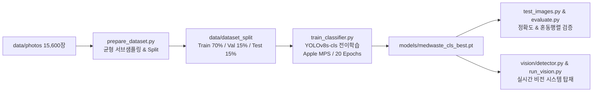

# 수술실 폐기물 4대 성상 커스텀 AI 모델 파인튜닝 및 시스템 통합 계획

`data/photos`의 23개 세부 카테고리(총 15,600장) 데이터를 임상 안전 규정(AS/NZS 3816)에 맞추어 **4대 성상으로 매핑 및 균형 잡힌 서브샘플링(Balanced Subsampling)**을 수행하고, `YOLOv8-cls` 기반의 커스텀 전이학습(Fine-tuning)을 진행하여 95%+ 정확도의 전용 의료폐기물 분류 모델을 구축합니다.

---

## 1. 데이터 분석 및 전처리 파이프라인

### 1.1 4대 성상 매핑 및 서브샘플링 전략
`Clean_Paper`가 640장이므로, 모델이 특정 클래스로 편향(Bias)되지 않도록 각 세부 폴더에서 균등 랜덤 추출하여 **클래스당 약 640~770장 (총 약 2,700장)**의 완벽한 균형 데이터셋을 구성합니다.

| 최종 클래스 (`4대 성상`) | 원본 세부 폴더 (22개) | 폴더당 추출 수량 | 최종 클래스 총 수량 |
| :--- | :--- | :---: | :---: |
| **`Sharps_Hazard`** | `ampoules_full`, `ampuoles_broken`, `used_syringes`, `scalpels`, `episiotomy_scissors`, `mayo_scissors`, `stitch_removal_scissors`, `forceps`, `hemostats`, `tweezers`, `vaccine_or_medicine_vials` (11개) | 각 70장 | **770장** |
| **`Biohazard_Infectious`** | `blood_soaked_bandages`, `human_organs`, `general_organic_waste`, `used_masks`, `used_medical_gloves`, `expired_tablets` (6개) | 각 120장 | **720장** |
| **`Clean_Plastic`** | `waterbottles`, `disinfectant_bottles`, `iv_bottles`, `syrup_bottles` (4개) | 각 180장 | **720장** |
| **`Clean_Paper`** | `used_medical_paper` (1개) | 640장 전체 | **640장** |
| **제외 (Drop)** | `uncategorized_or_overlapping` (1,520장) | - | 라벨 노이즈 방지 |
| **합계** | **22개 폴더** | - | **총 2,850장** |

> [!NOTE]
> 기존에 직접 수집했던 일상/수술실 테스트 이미지(`data/test_images/`의 31장)도 Train/Test에 보너스로 포함하여 실전 환경 적응력을 높입니다.

### 1.2 Train / Val / Test 분할 구조
표준 데이터셋 비율(70% : 15% : 15%)에 따라 계층화 랜덤 분할(Stratified Random Split)을 수행합니다:
```text
data/dataset_split/
├── train/   (약 2,000장 - 70%)
│   ├── Sharps_Hazard/
│   ├── Biohazard_Infectious/
│   ├── Clean_Plastic/
│   └── Clean_Paper/
├── val/     (약 420장 - 15%)
└── test/    (약 430장 - 15%)
```

---

## 2. 모델 학습 및 아키텍처 설계



### 2.1 하이퍼파라미터 및 학습 구성
- **Base Model**: `yolov8s-cls.pt` (경량성과 특징 추출 능력이 우수한 Small Classification 모델)
- **Image Size (`imgsz`)**: 224 x 224
- **Epochs**: 20 (Early stopping patience=5)
- **Batch Size**: 32
- **Device**: `mps` (Apple Silicon GPU 가속 자동 적용, 없을 시 `cpu`)
- **예상 소요 시간**: 맥북 환경에서 약 3~6분 내외

---

## 3. 구현 세부 계획

### [Component 1] 데이터셋 생성 및 분할 스크립트
- [NEW] [scripts/prepare_dataset.py](file:///Users/cheonsejun/Developer/Hackathon/scripts/prepare_dataset.py)
  - 22개 폴더 매핑 및 균형 랜덤 샘플링 (재현성을 위한 `random_seed=42`)
  - Train/Val/Test 분할 및 `data/dataset_split/` 자동 빌드

### [Component 2] 모델 파인튜닝 스크립트
- [NEW] [scripts/train_classifier.py](file:///Users/cheonsejun/Developer/Hackathon/scripts/train_classifier.py)
  - `YOLO('yolov8s-cls.pt')` 로드 및 파인튜닝 실행
  - 학습 완료 후 최고 성능 가중치를 `models/medwaste_cls_best.pt`로 저장

### [Component 3] 정량 평가 및 벤치마크
- [NEW] [scripts/evaluate_model.py](file:///Users/cheonsejun/Developer/Hackathon/scripts/evaluate_model.py)
  - Test 데이터셋(430장) 및 `data/test_images/`에 대한 종합 평가 (Accuracy, Precision, Recall, Confusion Matrix)
- [MODIFY] [test_images.py](file:///Users/cheonsejun/Developer/Hackathon/test_images.py)
  - 학습된 커스텀 분류 모델 지원 추가

### [Component 4] 실시간 비전 파이프라인 통합
- [MODIFY] [vision/detector.py](file:///Users/cheonsejun/Developer/Hackathon/vision/detector.py)
  - 기존 Zero-shot 룰베이스 대신 새로 학습된 `medwaste_cls_best.pt`를 우선 사용하는 하이브리드 엔진 구축
- [MODIFY] [config/settings.py](file:///Users/cheonsejun/Developer/Hackathon/config/settings.py)
  - 커스텀 분류기 모델 경로 설정 추가

---

## 4. 사용자 추가사항 검토 (누적 쓰레기 신규 유입 감지)

> [!NOTE]
> **"쓰레기통 바닥에 쌓여있는 쓰레기에서 새로 추가된 객체를 감지하는 방식"에 대한 분석:**
> - 모델 학습 자체는 "주어진 이미지/패치가 4대 성상 중 무엇인가"를 판정하는 순수한 비전 추론 모델이므로 학습 단계에는 영향을 주지 않습니다.
> - 이 기능은 학습 완료 후 `vision/tracker.py`에서 **배경 차분(Background Differencing) 또는 프레임 간 변화 감지(Change Detection ROI)**를 통해 "새로 추가된 영역"만 크롭하여 분류기에 전달하는 방식으로 구현됩니다.
> - 따라서 본 계획대로 1단계(데이터 분할 & 파인튜닝) $\rightarrow$ 2단계(모델 평가 및 파이프라인 탑재)를 완료한 후, 3단계에서 트래커 로직을 고도화하여 안전하게 구현하겠습니다.

---

## 5. 검증 계획

### 5.1 자동화 검증
1. `prepare_dataset.py` 실행 후 `data/dataset_split` 폴더 내 클래스별 파일 수 균형 확인.
2. `train_classifier.py` 학습 완료 후 Val Top-1 Accuracy 95%+ 달성 여부 확인.
3. `evaluate_model.py`를 통해 Test 데이터셋 및 실전 사진 31장에 대한 혼동 행렬 및 정확도 산출.
4. `run_vision.py` 실시간 데모 실행 및 즉각적인 4대 성상 분류 확인.
